# Red Social "Girls Gamers"

- Link proyecto: [Ir al sitio final](https://lunaconstanza.github.io/SCL019-social-network/src/index.html)

## Índice

* [1. Introducción](#1-Introducción)
* [2. Investigación UX](#2-Investigación-UX)
* [3. Diseño UI](#3-Diseño-UI)
* [4. Herramientas Utilizadas](#4-Herramientas-de-elaboración)

## 1. Introducción

Al notar que la población femenina gamer esta en aumento, algunas veces las usuarias querían participar en squad (equipos) femeninos, no obstante aun no es fácil encontrar compañeras con los mismos intereses en juegos o con horarios similares por lo cual nuestra  red social  tiene como finalidad poder conectar a estas personas que se identifican como mujer en el mundo gamer y que les interese formar squad entre ellas.

### 1.1 Definición del proyecto
Nuestro proyecto se hizo basado en SPA (Single Page Aplication) y HTML dinámico como también CSS grid (comenzamos a diseñar con Mobile First lo cual lo vuelve responsive) y asi tambien el uso de Firebase por primera vez.

### 1.2 Imagen final del sitio.

En las siguientes imagenes mostraremos nuestro sitio.

* Comenzamos por la pantalla de inicio en la que usamos nuestro logo para la bienvenida de la usuaria.

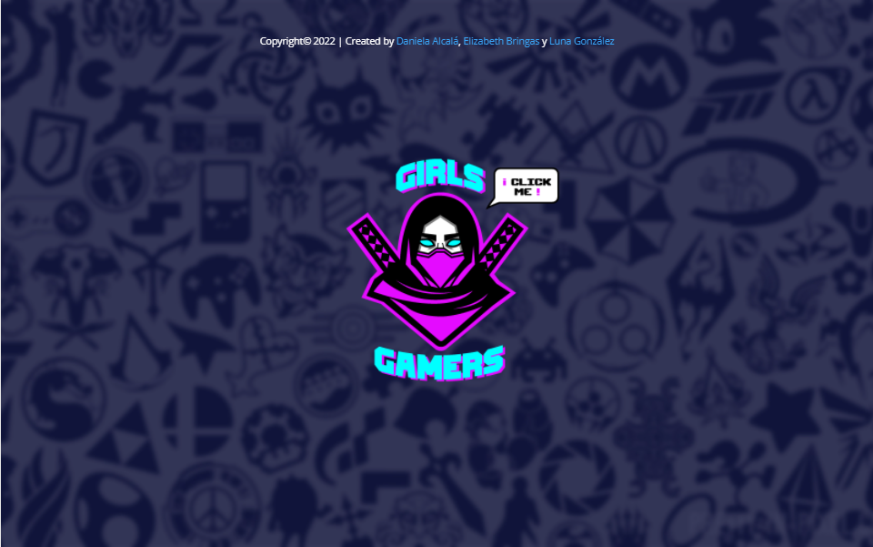

* Pasa a la pagina de login en el cual la usuaria puede ingresar a su cuenta, en la cual tambien puede recuperar su contraseña o crear una nueva cuenta.

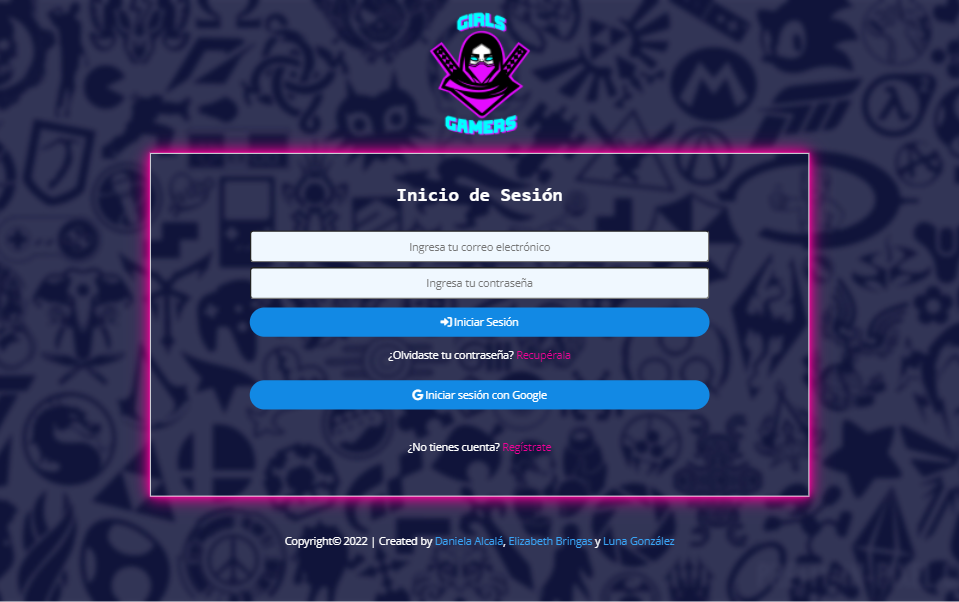
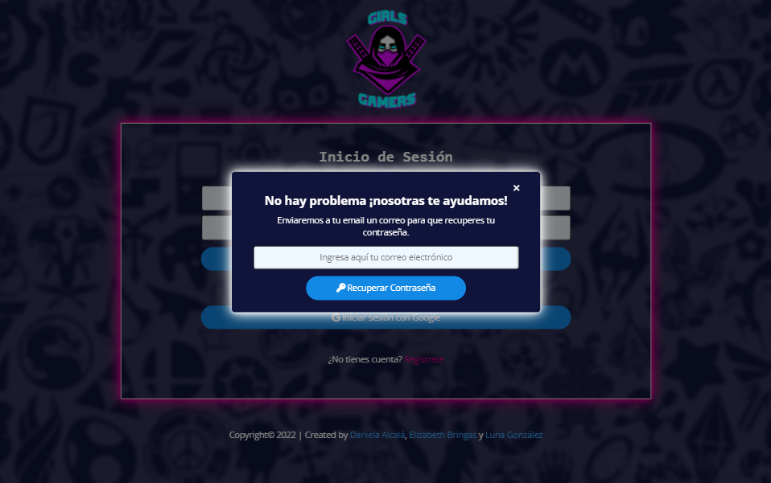

* Pagina de registro, esta solicitara los datos necesarios para autenticarse en nuestro sitio.

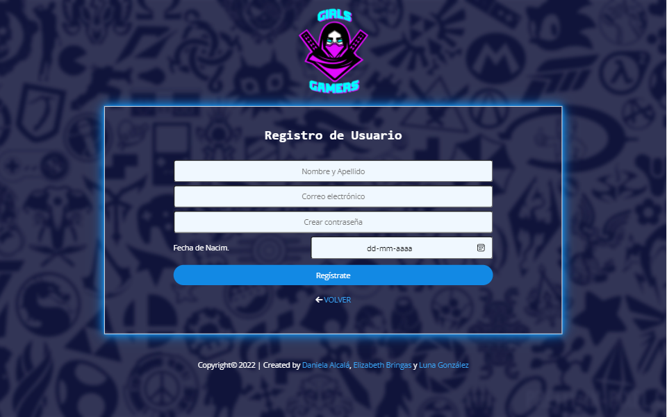

* Una vez los datos han sido bien ingresados y se ha confirmado la creacion de cuenta desde el correo, ingresamos al muro; donde podremos publicar post, eliminarlos y dar/quitar like.

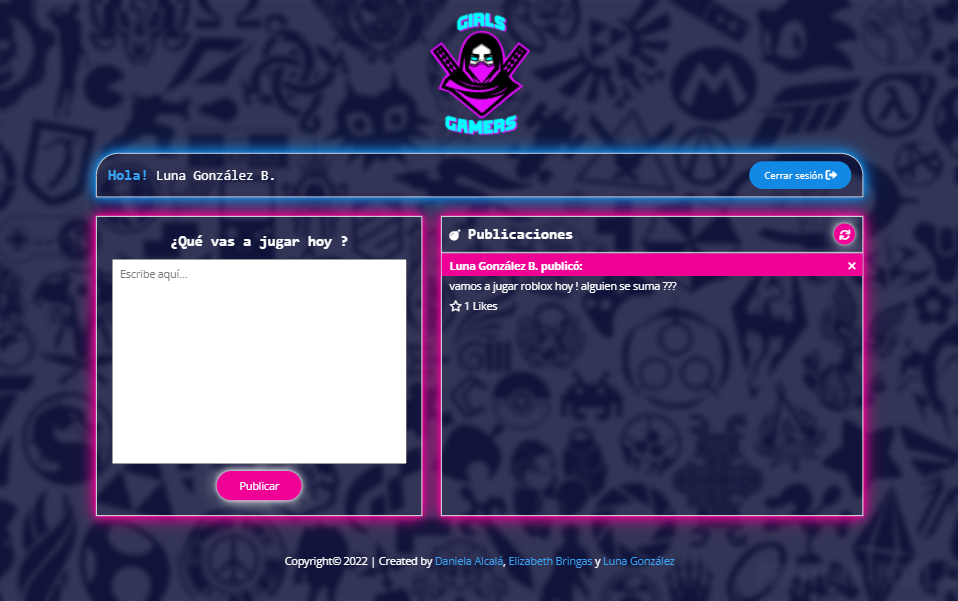

* El diseño es responsive por lo cual se adapta a diferentes tamaños de pantalla.

_Para móvil_

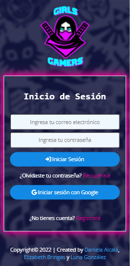 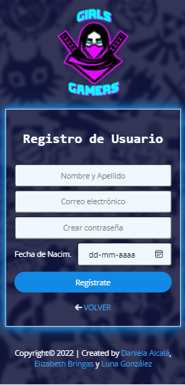 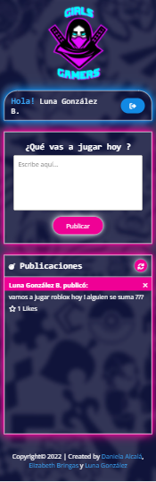

## 2. Investigación UX
Para poder conocer a nuestro público objetivo usamos la herramienta [_Forms_Google_](https://workspace.google.com/intl/es-419/products/forms/?utm_source=google&utm_medium=cpc&utm_campaign=latam-CL-all-es-dr-bkws-all-all-trial-e-dr-1011272-LUAC0011982&utm_content=text-ad-none-any-DEV_c-CRE_479425067880-ADGP_Hybrid%20%7C%20BKWS%20-%20MIX%20%7C%20Txt%20~%20Forms-KWID_43700057707270852-kwd-868999111187&utm_term=KW_crear%20google%20forms-ST_crear%20google%20forms&gclsrc=ds&gclsrc=ds), con esto logramos acotar más la información que teniamos con anterioridad.

* Adjuntamos el [_link_](https://docs.google.com/forms/d/1XEZL6fkU7Ic3_JFhvgJhaJ8oBXARNI0mEnmy7qwFRJg/viewanalytics) de encuesta.
Este es el formulario con los resultados obtenidos para nuestra investigación. 

### ¿Quiénes son los principales usuarios de producto?
* R: Cualquier persona que se sienta mujer y juegue de modo online en cualquier plataforma digital, además que se sienta cómoda al compartir con más mujeres y en la mayoria dentro del rango de 21 a 38 años según nuestras estadísticas.

## 3. Diseño UI
### 3.1 Prototipo baja fidelidad
En nuestro diseño de baja fidelidad, lo hicimos colaborativamente desde zoom y hecho directamente en Abode Ilustrator. A conticuacion imagenes del resultado de nuestro trabajo.

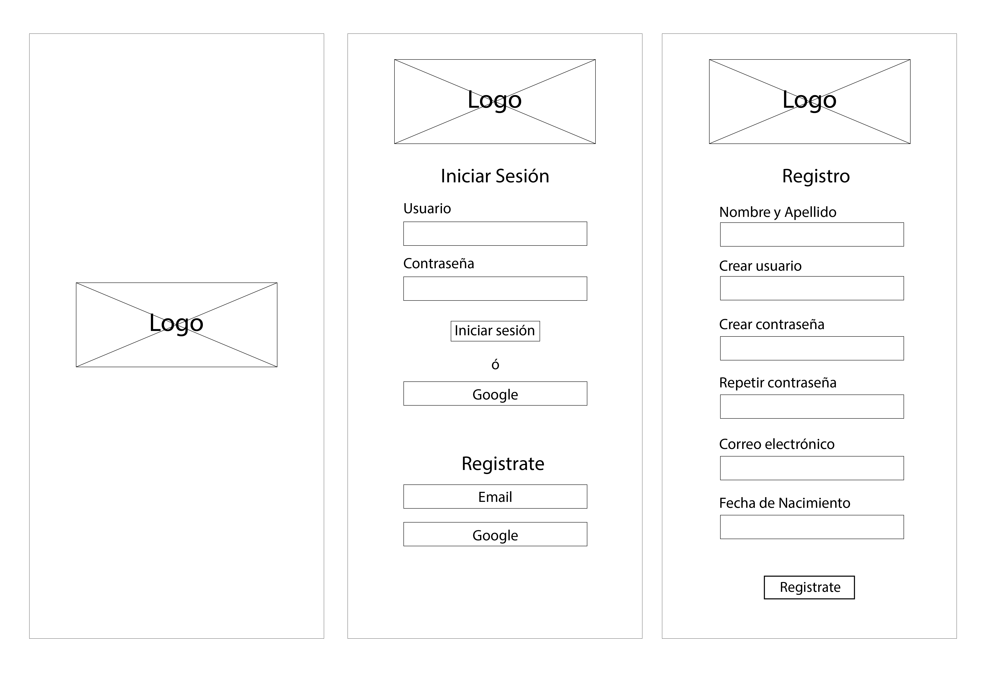
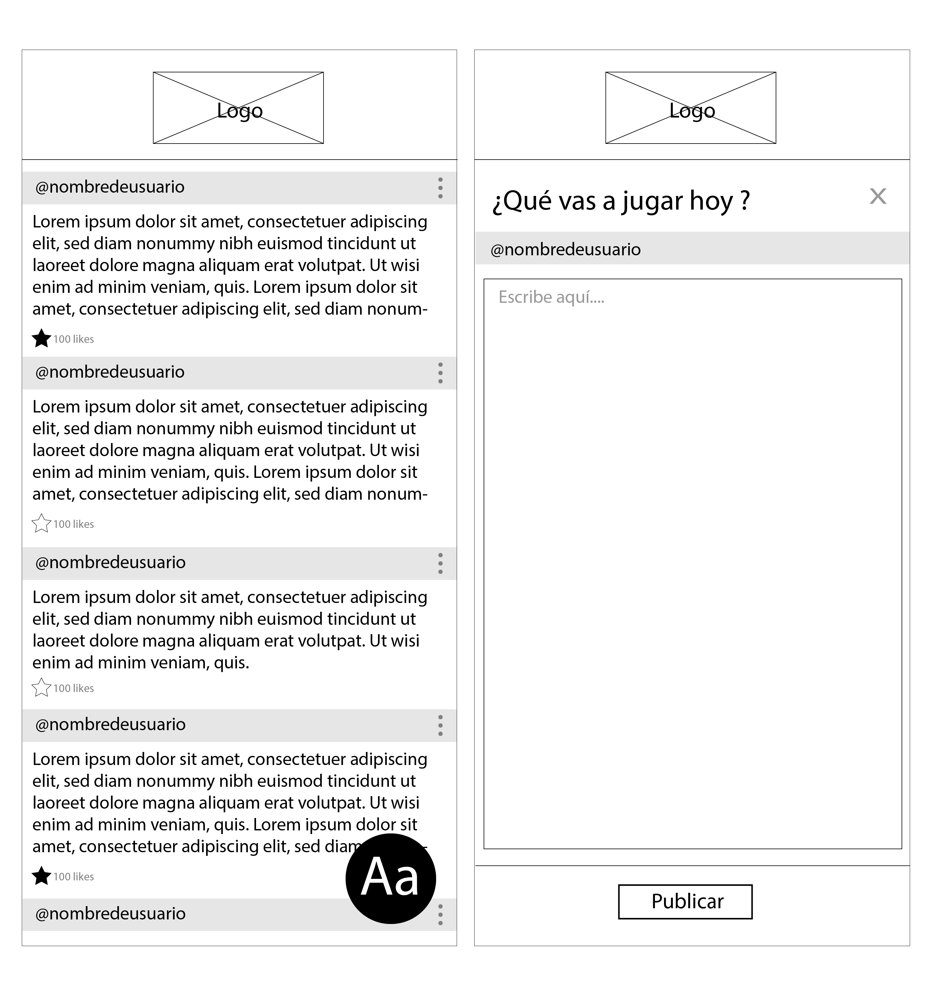
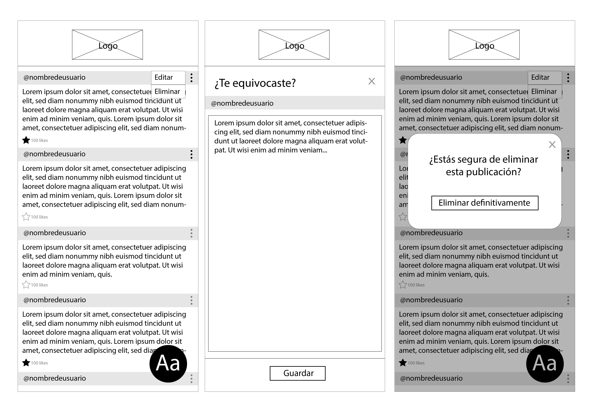

### 3.2 Testeo de Usabilidad
Para lograr un buen resultado durante el transcurso de creación de nuestro proyecto realizamos dos testeos a traves de encuestas de [_Forms_Google_](https://workspace.google.com/intl/es-419/products/forms/?utm_source=google&utm_medium=cpc&utm_campaign=latam-CL-all-es-dr-bkws-all-all-trial-e-dr-1011272-LUAC0011982&utm_content=text-ad-none-any-DEV_c-CRE_479425067880-ADGP_Hybrid%20%7C%20BKWS%20-%20MIX%20%7C%20Txt%20~%20Forms-KWID_43700057707270852-kwd-868999111187&utm_term=KW_crear%20google%20forms-ST_crear%20google%20forms&gclsrc=ds&gclsrc=ds) con los cuales logramos iterar lo necesario.
* He aquí el [_link_](https://docs.google.com/forms/d/1eWEE1zufOlCosedHUvRuLKqEhddaAe9Z6QJA9rgfFIk/viewanalytics) del primer testeo.
* He aquí el [_link_](https://docs.google.com/forms/d/1Q9Ahe0J-bQMYLSgVT_lyPp5_bH9G6k9t4Wa6DxD7XFk/viewanalytics) del segundo testeo.

### 3.3 Prototipo de alta fidelidad
Por medio de la aplicación [_Figma_](https://www.figma.com/community) preparamos nuestro prototipo de alta fidelidad.

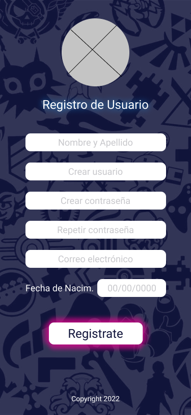
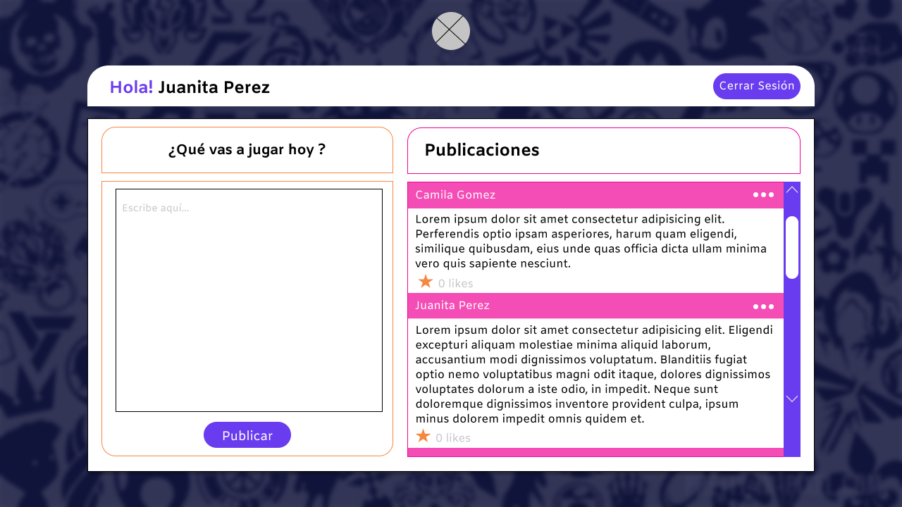

### 3.4 Historias de Usuarios
En este proyecto detallamos 7 "historias de usuarios" con el fin de visualizar y reducir todas las necesidades que la creaccion de esta redsocial pudiera necesitar, lo realizamos de forma colaborativa con la herramienta Project que provee Github.

* Adjuntamos [_link_](https://github.com/LunaConstanza/SCL019-social-network/projects/1) de nuestro project de Github.

_Herramienta Issues de GitHub_

_Herramienta Milestones de GitHub_
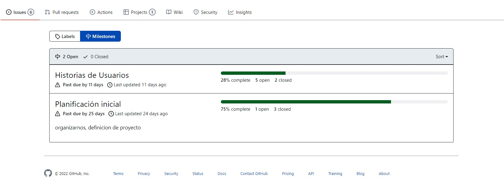

_Historias de usuario en proceso_
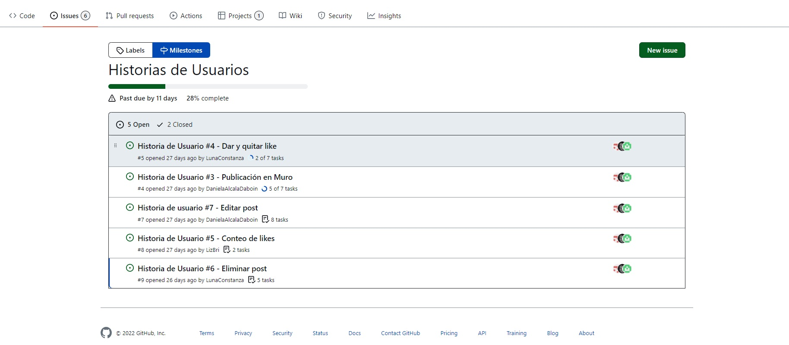

## 4. Herramientas de Elaboración.
Para este proyecto utilizamos:
* HTML, CSS, JS.
* Firebase
* Adobe Ilustrator
